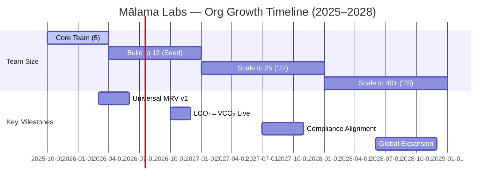

# Mālama Labs Organizational Charts (2025–2028)

This file contains the full set of Mermaid charts for Mālama Labs Inc., showing company growth from 2025 through 2028, including a timeline view.

---

## Org Chart — Q4 2025 (Current)

```mermaid
flowchart TB
  A[Board & Advisors]:::board --> CEO[Tyler Malin<br/>Chief Executive Officer]:::exec
  CEO --> COO[Jeffrey Wise<br/>Chief Operating Officer]:::exec
  CEO --> CTO[Dominick Garey<br/>Chief Technology Officer]:::exec

  subgraph Ops2025[Operations & Development]
    D1[Full-Stack Developer]:::ic
    D2[Research Analyst<br/>(Carbon Methodologies)]:::ic
    D3[Project Coordinator<br/>(Hawaiʻi Sites)]:::ic
  end

  COO --> Ops2025
  classDef exec fill:#0e6f57,color:#fff,stroke:#0a4a3b,stroke-width:1.5px;
  classDef board fill:#2e4057,color:#fff,stroke:#1f2c3d,stroke-width:1.5px;
  classDef ic fill:#e8f4ef,color:#0a4a3b,stroke:#90c2ae;
```

---

## Org Chart — Year 1 (2026)

```mermaid
flowchart TB
  A[Board & Advisors]:::board --> CEO[Tyler Malin<br/>CEO]:::exec
  CEO --> COO[Jeffrey Wise<br/>COO]:::exec
  CEO --> CTO[Dominick Garey<br/>CTO]:::exec

  subgraph Eng2026[Product & Engineering (5 FTE)]
    E1[VP Engineering]:::lead
    E2[Blockchain Lead (Smart Contracts)]:::role
    E3[Data Scientist (AI Risk Engine)]:::role
    E4[IoT Systems Engineer]:::role
    E5[DevOps & QA Lead]:::role
  end

  subgraph Sci2026[Carbon Science & MRV (3 FTE)]
    S1[Carbon Methodology Lead]:::lead
    S2[MRV Integration Engineer]:::role
    S3[Field Data Technician]:::role
  end

  subgraph Ops2026[Operations & Partnerships (3 FTE)]
    O1[Director of Partnerships (Registries & Certifiers)]:::lead
    O2[Community Engagement Manager]:::role
    O3[Operations Associate]:::role
  end

  COO --> Ops2026
  CTO --> Eng2026
  CEO --> Sci2026

  classDef exec fill:#0e6f57,color:#fff,stroke:#0a4a3b,stroke-width:1.5px;
  classDef board fill:#2e4057,color:#fff,stroke:#1f2c3d,stroke-width:1.5px;
  classDef lead fill:#2f9e44,color:#fff,stroke:#227a33;
  classDef role fill:#e8f4ef,color:#0a4a3b,stroke:#90c2ae;
```

---

## Org Chart — Year 2 (2027)

```mermaid
flowchart TB
  A[Board & Advisors]:::board --> CEO[CEO — Tyler Malin]:::exec
  CEO --> COO[COO — Jeffrey Wise]:::exec
  CEO --> CTO[CTO — Dominick Garey]:::exec
  CEO --> CFO[CFO — New Hire]:::exec
  CEO --> CSO[CSO — Chief Sustainability Officer]:::exec
  CEO --> VPBD[VP Business Development]:::exec

  subgraph Eng2027[Engineering & Product (8 FTE)]
    EPM[Product Manager]:::lead
    EAPI[Senior Software Engineer (API + SDK)]:::role
    EBC[Blockchain Dev (Bridges)]:::role
    EML[ML Engineer]:::role
    EUX[UX/UI Designer]:::role
    EQA[QA & Data Ops]:::role
    ESE[Software Engineer]:::role
    EDO[DevOps]:::role
  end

  subgraph Sci2027[Carbon Science & Protocols (5 FTE)]
    SBio[Biochar/Soil Scientist]:::role
    SOcn[Blue Carbon Specialist]:::role
    SLCA[Lifecycle Analyst]:::role
    SRes[Research Associate]:::role
    SLead[Science Lead]:::lead
  end

  subgraph Ops2027[Operations, Finance & Compliance (6 FTE)]
    Comp[Director of Compliance]:::lead
    FinM[Finance Manager]:::role
    HR[HR & Talent Lead]:::role
    Prog[Program Ops Coordinator]:::role
    Legal[Legal & Risk Analyst]:::role
    Ctrl[Controller]:::role
  end

  subgraph BD2027[Business Development & Partnerships (4 FTE)]
    PLeads[Carbon Project Partnerships Lead]:::lead
    Sales[Corporate Offtake Sales Lead]:::role
    Mkt[Marketing & Communications]:::role
    Eco[Ecosystem Relations Coordinator]:::role
  end

  CTO --> Eng2027
  CSO --> Sci2027
  COO --> Ops2027
  VPBD --> BD2027
  CFO --> Ops2027

  classDef exec fill:#0e6f57,color:#fff,stroke:#0a4a3b,stroke-width:1.5px;
  classDef board fill:#2e4057,color:#fff,stroke:#1f2c3d,stroke-width:1.5px;
  classDef lead fill:#2f9e44,color:#fff,stroke:#227a33;
  classDef role fill:#e8f4ef,color:#0a4a3b,stroke:#90c2ae;
```

---

## Org Chart — Year 3 (2028)

```mermaid
flowchart TB
  A[Board & Advisory Council]:::board --> CEO[CEO — Tyler Malin]:::exec
  CEO --> COO[COO — Jeffrey Wise]:::exec
  CEO --> CTO[CTO — Dominick Garey]:::exec
  CEO --> CFO[CFO]:::exec
  CEO --> CSO[CSO]:::exec
  CEO --> VPGM[VP, Global Markets]:::exec

  subgraph Eng[Engineering & Data Systems (10)]
    EngL[Head of Eng]:::lead
    EngBC1[Blockchain Dev]:::role
    EngBC2[Blockchain Dev]:::role
    EngML1[ML Engineer]:::role
    EngML2[ML Engineer]:::role
    EngAPI[API Integrations]:::role
    EngDev[Full-Stack Dev]:::role
    EngDev2[Full-Stack Dev]:::role
    EngQA[QA/Data Ops]:::role
    EngOps[DevOps]:::role
  end

  subgraph Sci[Carbon Science & MRV (8)]
    SciL[Science Lead]:::lead
    SciSoil[Soil/Biochar Scientist]:::role
    SciOcean[Blue Carbon Specialist]:::role
    SciERW[ERW Specialist]:::role
    SciMRV1[MRV Analyst]:::role
    SciMRV2[MRV Analyst]:::role
    SciVal[Validation Engineer]:::role
    SciRes[Research Associate]:::role
  end

  subgraph Prod[Product & Design (5)]
    PM[Product Manager]:::lead
    UX1[Designer]:::role
    FE1[Frontend Dev]:::role
    FE2[Frontend Dev]:::role
    BA[Business Analyst]:::role
  end

  subgraph Comp[Compliance & Certification (4)]
    CompL[Director of Compliance]:::lead
    Reg[Registry Liaison]:::role
    QA[Quality Assurance]:::role
    Leg[Legal Analyst]:::role
  end

  subgraph Fin[Finance & Operations (4)]
    Ctrl[Controller]:::role
    FinM[Finance Manager]:::role
    OpsM[Operations Manager]:::role
    HR[HR & Talent]:::role
  end

  subgraph Sales[Sales & Partnerships (5)]
    BDL[Head of BD]:::lead
    Sales1[Corp Offtake Sales]:::role
    Sales2[MRVaaS Sales]:::role
    Mkt[Marketing/Comms]:::role
    Partner[Partner Relations]:::role
  end

  subgraph Comm[Community & Impact (3)]
    CommL[Program Lead]:::lead
    Regional[Regional Stewardship Lead]:::role
    Impact[Impact Reporting]:::role
  end

  CTO --> Eng
  CSO --> Sci
  COO --> Prod
  COO --> Comp
  CFO --> Fin
  VPGM --> Sales
  COO --> Comm

  classDef exec fill:#0e6f57,color:#fff,stroke:#0a4a3b,stroke-width:1.5px;
  classDef board fill:#2e4057,color:#fff,stroke:#1f2c3d,stroke-width:1.5px;
  classDef lead fill:#2f9e44,color:#fff,stroke:#227a33;
  classDef role fill:#e8f4ef,color:#0a4a3b,stroke:#90c2ae;
```

---

## Timeline View — Headcount & Milestones


